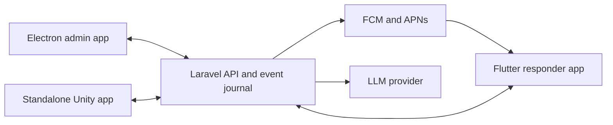

# AMAN architecture and delivery plan

## Agreed product shape

AMAN has one Laravel backend and three independent clients:

1. **Admin desktop app:** an Electron application for control-room operators. It owns monitoring, incident review, responder selection, approval, coordination, and the AI advisor experience.
2. **Responder mobile app:** a Flutter application for assigned missions, push notifications, acknowledgement, progress updates, and operator messaging.
3. **Unity simulation:** a standalone application shown on a second screen. The Unity work is owned by the Unity developer and integrates through the contracts documented in `docs/unity-events.md`.

The clients do not communicate directly with one another. They synchronize through the backend so reconnects, audit history, permissions, and state remain consistent.

## System boundaries

Laravel is the source of truth for organizations, events, zones, incidents, responders, missions, messages, approvals, and the ordered event journal. It validates every state transition and broadcasts accepted changes. Provider credentials, mobile push credentials, and LLM API keys stay on the server.

The Electron app may request an analysis or approve a proposed response, but it cannot directly call an LLM with a bundled secret or bypass backend workflow rules. The Flutter app can act only as its authenticated responder. Unity receives only the event and simulation data needed to render the scene and has no authority to dispatch responders or alter official incident state.

## Operational flow

1. The backend receives simulated or approved provider observations and evaluates zone risk using configured thresholds.
2. A deterministic rule detects a material anomaly and creates or updates an incident.
3. The backend produces an eligible, ranked responder list from authorization, availability, location freshness, distance, role, and reachability.
4. The AI advisor explains the anomaly and recommends one candidate from that list. If AI is unavailable or invalid, the deterministic ranking remains usable.
5. The Electron app alerts the operator with the evidence, recommendation, uncertainty, and proposed action.
6. The operator approves, rejects, or selects another eligible responder. Only explicit approval can dispatch a mission.
7. The backend notifies the Flutter app. The responder acknowledges and reports progress; all clients receive the resulting ordered events.
8. The backend resolves the incident only after its existing verification rules pass and records the full decision history.

Device counts are estimates rather than exact people counts. Venue owners must review safety thresholds before real use.

## AI advisor

The first version is an incident advisor, not an autonomous dispatcher. It should be triggered by backend incident events rather than continuously reading every telemetry sample.

The backend sends a compact incident snapshot containing the zone, trend, thresholds, data age and quality, active incidents, and the deterministic candidate list. The model returns a strict schema containing:

- a short operator alert;
- urgency and confidence labels;
- one recommended responder ID from the supplied candidates, or no recommendation;
- concise evidence and uncertainty;
- a proposed operator action.

Laravel validates the response, rejects unknown responder IDs, stores the prompt version and result for audit, and exposes the result to Electron. The model has no dispatch tool. Provider failures, timeouts, or malformed output degrade to the deterministic recommendation without blocking incident handling.

Use a provider-neutral interface and configure the provider and model through server environment variables. Start with a fast model and evaluate it against a fixed set of incident scenarios. `gpt-5.6-luna` is the initial OpenAI candidate for latency and cost; Claude Sonnet is a reasonable quality comparison. Do not hard-code either provider into the incident workflow.

### The advisor is an agent, not a single call

The advisor that runs today is the CAMARA orchestration agent in `ml/agent`, a
separate Python process built on the OpenAI Agents SDK. It decides which CAMARA
APIs to consult — Device Reachability, Location Verification, Congestion
Insights — and returns the calls it made alongside its recommendation.

Only Laravel talks to it, and it only talks back to Laravel: its three tools are
one private, token-authenticated, loopback-only gateway,
`POST /api/internal/agent/camara`, which is also the only thing that touches
provider credentials, phone numbers, or raw coordinates. It has no dispatch
tool. A recommendation is rejected in code unless the tool trace supports it: a
reachable device, a passing location check, and congestion evidence for a
critical incident. A failure returns a `degraded` result with no recommendation,
and the deterministic ranking stays the operational answer.

Provenance is declared per operation and never upgraded, so the console can
show an operator which readings came off the live network and which came from
the venue simulation. Today only Device Reachability is live.

## Client guidance

### Electron admin app

Migrate the existing React operator experience rather than rebuilding it. Electron should use context isolation, disable Node integration in renderer pages, expose only narrow preload APIs, and store no backend or model secrets. High-value additions are an incident inbox, AI advisory card, evidence drawer, responder comparison, approval/rejection reason, connectivity state, and an audit timeline.

### Flutter responder app

The first release should focus on sign-in, assigned mission, acknowledge/decline, navigation context, `en_route`/`on_scene`/`cleared` status, and mission chat. Background delivery must use FCM/APNs push notifications; a WebSocket alone is not reliable while a phone app is suspended. Opening a notification should fetch the current mission from Laravel before showing an action.

### Standalone Unity app

Unity loads an initial snapshot from Laravel and consumes the same ordered event stream as Electron. It should reconnect and replay missed events using the last processed sequence. It remains a visualization client and should continue rendering the last known safe state if the live connection drops.

## Delivery phases

### Phase 1 — contracts and repository layout (prototype complete)

- Freeze versioned DTOs for incidents, responders, missions, AI advice, and live events.
- Separate current demo routes from the planned authenticated API in documentation.
- Keep the Electron renderer in `frontend/` to preserve the existing React history, add Flutter in `responder-mobile/`, and keep Unity in its owner's repository.
- Add contract examples that all three clients can test against.

### Phase 2 — Electron shell and admin workflow (prototype complete)

- Move the existing React operator UI into a secure Electron shell.
- Remove the embedded responder test panel from the production admin navigation.
- The hackathon client uses the local demo identity and polling contract. Production authentication and sequence-based event replay remain future work.

### Phase 3 — responder mobile workflow (foreground prototype complete)

- Flutter uses environment-based API configuration, local demo identity selection, mission polling, visible assignment alerts, acknowledgement, progress updates, and messages.
- Add FCM/APNs credentials, push token registration, and production authentication after the team selects its Firebase and Apple accounts.
- Test duplicate notifications, expired missions, offline acknowledgement, and reconnect behavior.

### Phase 4 — AI advisor (prototype complete)

- Add the provider-neutral backend interface and structured advice schema.
- Run advice asynchronously when an incident is created or materially changes.
- Validate and audit every response; add operator feedback and deterministic fallback.
- The prototype defaults to `gpt-5.6-luna` with strict structured output, low reasoning effort, server-side candidate validation, and deterministic fallback.
- Evaluate latency and operator usefulness against rehearsal scenarios before selecting the production model.
- The single model call has been replaced by the CAMARA orchestration agent, and the console renders its tool trace. Remaining: serve Location Verification and Congestion Insights from Nokia Network-as-Code rather than the venue simulation, and carry the operator's language into the run.

### Phase 5 — Unity and full rehearsal

- Give the Unity developer snapshot, event, authentication, and reconnect fixtures.
- Run Electron and Unity on separate screens while a Flutter device receives the dispatched mission.
- Exercise provider failure, stale data, LLM timeout, duplicate events, lost connectivity, rejection, reassignment, and resolution.

## Decisions still needed

- Deployment target and whether the control-room environment can always reach a hosted backend.
- Authentication method for real operators and responders.
- FCM/APNs ownership and mobile distribution accounts.
- Data retention for incident history, model inputs/outputs, and responder location.
- Whether Unity is purely simulated for the hackathon or will later display production observations.
